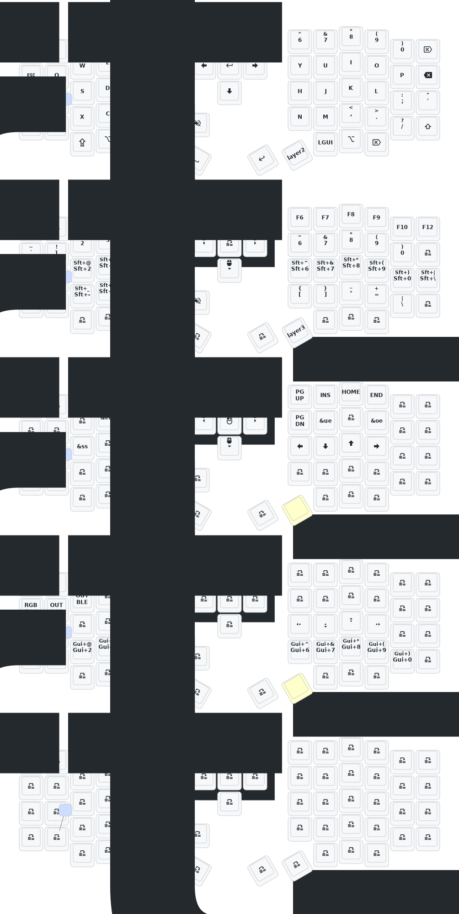

# Sofle

## UPDATE

- Jetzt Crosscompatibel mit Windows 11 & Linux
- Ausgelegt an US-International Layout
- Layer 3 durch Druck von Layer 1 & 2 Taste gleichzeitig hinzugefügt
- Die Umlaute werden über die Super 3 Taste (ALTGR oder rechte ALT Taste) -> üäöü߀

## MAPPING

